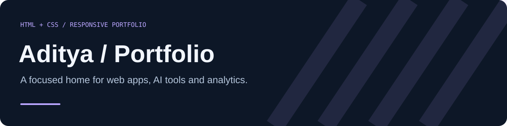
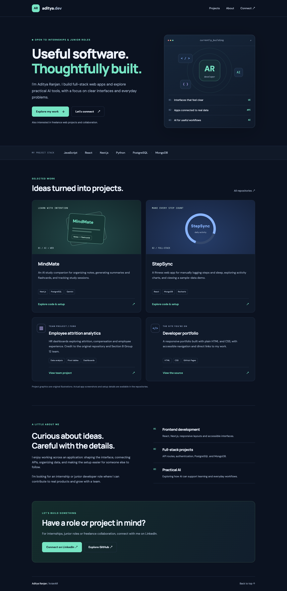

# Aditya Ranjan · Developer Portfolio

A responsive HTML/CSS portfolio presenting full-stack web projects and a team analytics project, with a clear path to connect on LinkedIn.

**[Visit the portfolio](https://kvianar.github.io/Capstone/)** · [GitHub profile](https://github.com/kvianAR) · [LinkedIn](https://www.linkedin.com/in/aditya-ranjan-37a827323/)



## Design and features

- Navy, mint and blue palette with custom CSS project illustrations.
- Real project summaries and source links for MindMate, StepSync and employee attrition analytics.
- Clear interest in internships, junior roles and freelance collaboration.
- Responsive cards and navigation, keyboard focus styles, skip link and reduced-motion support.
- Page title, description, social metadata and original SVG favicon.
- Email and phone are not displayed.

Project illustrations are conceptual graphics, not app screenshots. The attrition project is credited as team work and a fork.

## Run locally

No build tool or JavaScript dependency is required.

```bash
git clone https://github.com/kvianAR/Capstone.git
cd Capstone
python3 -m http.server 8000
```

Open [localhost:8000](http://localhost:8000). Google Fonts enhance the typography; system fonts work if they cannot load.

## Files

| File | Purpose |
| --- | --- |
| `index.html` | Portfolio content and accessible navigation |
| `hello1.css` | Responsive layout and original project illustrations |
| `favicon.svg` | AR monogram |
| `docs/assets/` | Repository banner and actual portfolio screenshots |
| `<!DOCTYPE html>.html` | Redirect for the previous entry filename |

## Deployment

GitHub Pages serves `index.html` from the root of the `main` branch. No backend, analytics or contact form is required; contact links go directly to LinkedIn.

## Credits and reuse

Created for [Aditya Ranjan](https://github.com/kvianAR). Employee attrition work is attributed to the original project and Section B Group 12 team. No repository license has been chosen.
